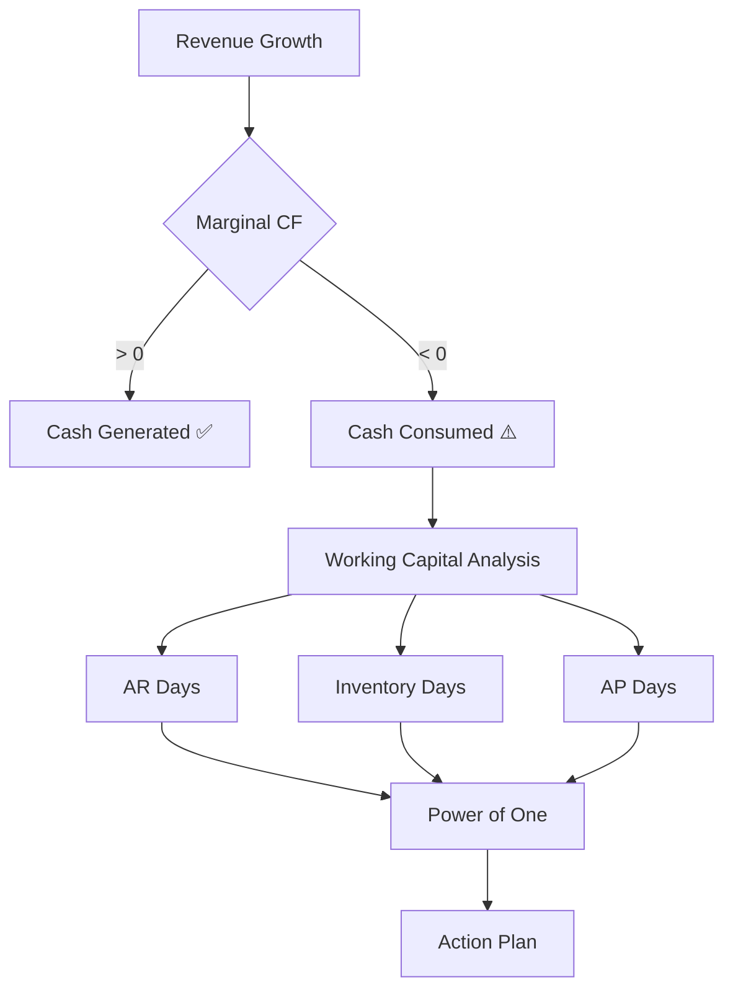

# Cash Flow Story

> **"Why doesn't growth generate cash?"**

## 🎯 Обзор методологии

**Cash Flow Story** — это методология финансового анализа и управления, разработанная Joss Milner, которая решает одну из самых распространённых проблем растущих компаний: **парадокс роста**.

### Парадокс роста

Многие успешные компании сталкиваются с ситуацией:
- 📈 Выручка растёт
- 💰 Прибыль растёт
- 💸 **Денег нет!**

Cash Flow Story объясняет **почему** это происходит и **что делать**.

## 🔑 Ключевые принципы

### 1. Прибыль ≠ Деньги

Традиционный учёт фокусируется на P&L (прибыли и убытках), но:
- Прибыль — это **accounting concept**
- Деньги — это **economic reality**

**Пример:**
- Продали товар за 100₽ → прибыль +100₽
- Клиент заплатит через 60 дней → денег нет!

### 2. Working Capital — главный виновник

При росте компании:

```
Working Capital = AR + Inventory - AP
```

- **AR (дебиторка)** ↑ — клиенты платят с задержкой
- **Inventory (запасы)** ↑ — нужно больше товара
- **AP (кредиторка)** ↑ медленнее — поставщики не ждут

**Результат**: WC растёт быстрее выручки → съедает cash

### 3. Маржинальный эффект

Не важно, сколько cash flow сейчас.
Важно: **что происходит с cash flow при росте?**

```
Marginal CF = ΔCash Flow / ΔRevenue
```

- Marginal CF > 0 → рост генерирует деньги ✅
- Marginal CF < 0 → рост съедает деньги ⚠️

## 📊 Структура методологии

### Показатели (Indicators)

1. **[Net Cash Flow](indicators/net-cash-flow.md)** — чистый денежный поток
2. **[Marginal Cash Flow](indicators/marginal-cash-flow.md)** — маржинальный ДДС
3. **[Clean Cash Flow](indicators/clean-cash-flow.md)** — чистый ДДС без роста
4. **[Working Capital](indicators/working-capital.md)** — оборотный капитал
5. **[AR Days](indicators/ar-days.md)** — период оборота дебиторки
6. **[Inventory Days](indicators/inventory-days.md)** — период оборота запасов
7. **[AP Days](indicators/ap-days.md)** — период оборота кредиторки

### Фреймворки (Frameworks)

1. **[Power of One](frameworks/power-of-one.md)** — 7 рычагов улучшения ДДС
2. **[Cash Conversion Cycle](frameworks/cash-conversion-cycle.md)** — цикл конвертации денег
3. **[Working Capital Analysis](frameworks/working-capital-analysis.md)** — декомпозиция WC

### Сценарии применения (Use Cases)

1. **[Рост без денег](use-cases/growth-without-cash.md)** — классический случай
2. **[Оптимизация Working Capital](use-cases/wc-optimization.md)** — снижение WC
3. **[Планирование роста](use-cases/growth-planning.md)** — расчёт потребности в капитале

## 🎓 Когда использовать Cash Flow Story?

### ✅ Подходит для:

- Компаний с **проблемами денежного потока**
- **Растущих компаний**, которым не хватает денег
- Бизнесов с **высоким Working Capital** (>15% revenue)
- **Manufacturing** и **Distribution** компаний
- Диагностики **парадокса роста**

### ❌ Менее подходит для:

- Стартапов на pre-revenue стадии
- Компаний с очень низким WC (<5%)
- Проблем, связанных с **ограничениями производства** (используйте [TOC](../theory-of-constraints/))
- Вопросов **выбора бизнес-модели** (используйте [Simple Numbers](../simple-numbers/))

## 🚀 Быстрый старт

### Диагностика за 5 минут

**Шаг 1:** Рассчитайте Marginal CF за последний год

```python
marginal_cf = (cash_flow_2024 - cash_flow_2023) / (revenue_2024 - revenue_2023)
```

**Шаг 2:** Интерпретация

| Marginal CF | Диагноз | Действия |
|-------------|---------|----------|
| > 0.2 | ✅ Отлично | Масштабируйтесь! |
| 0 to 0.2 | 🟡 Хорошо | Мониторьте WC |
| -0.2 to 0 | 🟠 Проблема | Анализ WC срочно |
| < -0.5 | 🔴 Катастрофа | Немедленные действия |

**Шаг 3:** Если Marginal CF < 0, проверьте WC%

```python
wc_percent = (working_capital / revenue) * 100
```

Норма: **8-15%** (зависит от отрасли)

**Шаг 4:** Примените [Power of One](frameworks/power-of-one.md) для определения рычагов улучшения

## 📚 Примеры

### Rebecca's Coffee

**Ситуация:**
- Revenue: 1,000,000 → 1,200,000 (+20%)
- Net Profit: 120,000 → 150,000 (+25%)
- Cash Flow: +20,000 → -50,000 😱

**Диагностика:**

```python
# Marginal CF
Δ CF = -50,000 - 20,000 = -70,000
Δ Rev = 1,200,000 - 1,000,000 = 200,000
Marginal CF = -70,000 / 200,000 = -0.35

# Working Capital
WC = 200,000
WC% = 200,000 / 1,200,000 = 16.7% ⚠️ (высоко!)
```

**Вывод:** Каждый рубль роста съедает 35 копеек денег!

**Решение:** [Анализ Power of One](use-cases/growth-without-cash.md#rebeccas-coffee-case)

Подробный разбор: [examples/rebeccas-coffee.md](../../examples/companies/rebeccas-coffee/)

## 🔗 Связь с другими методологиями

### Дополняет:

- **[Simple Numbers](../simple-numbers/)** — для планирования капитала
  - CFS диагностирует проблему
  - SN планирует потребность в капитале

- **[Theory of Constraints](../theory-of-constraints/)** — для оптимизации производства
  - CFS показывает cash проблему
  - TOC решает production constraint

### Отличия:

- **vs Simple Numbers**: CFS фокусируется на диагностике, SN на планировании
- **vs TOC**: CFS про cash flow, TOC про throughput
- **vs Lean**: CFS про деньги, Lean про процессы

См. подробнее: [Cross-Methodology Mapping](../../cross-methodology/indicator-mapping.md)

## 📖 Литература

### Основные источники:

1. **Milner, Joss.** "Cash Flow Story" — оригинальная методология
2. **Milner, Joss.** "Power of One" — фреймворк анализа рычагов

### Дополнительное чтение:

3. **Crabtree, Greg.** "Simple Numbers, Straight Talk, Big Profits!" — связь с Trade Capital
4. **Richards, Bill & Barney, Darius.** "12 Months to $1 Million" — практическое применение
5. **Goldratt, Eliyahu.** "Cash Machine" — связь с TOC

### Статьи и кейсы:

- "The Growth Paradox: Why Revenue Doesn't Equal Cash"
- "Working Capital Management: Beyond the Basics"
- "Power of One Analysis: A Practical Guide"

## 🛠️ Инструменты

### Калькуляторы:
- [Marginal CF Calculator](../../tools/calculators/marginal-cf.html)
- [Power of One Analyzer](../../tools/calculators/power-of-one.html)
- [Working Capital Optimizer](../../tools/calculators/wc-optimizer.html)

### Шаблоны:
- [Cash Flow Story Template.xlsx](../../tools/templates/cfs-template.xlsx)
- [Power of One Dashboard.xlsx](../../tools/templates/power-of-one-dashboard.xlsx)

### Python библиотека:
```python
from financial_methodologies import CashFlowStory

cfs = CashFlowStory(company_data)
diagnosis = cfs.diagnose()
power_of_one = cfs.power_of_one_analysis()
```

## 📊 Визуализация

### Концептуальная карта



## 🎯 Следующие шаги

1. **Изучите показатели**: [Indicators](indicators/)
2. **Примените Power of One**: [Power of One Framework](frameworks/power-of-one.md)
3. **Посмотрите примеры**: [Rebecca's Coffee Case](use-cases/growth-without-cash.md)
4. **Практика**: Проведите анализ своей компании

---

**Версия**: 1.0.0 | **Автор**: Joss Milner | **Применимо**: Manufacturing, Distribution, Retail, Services
